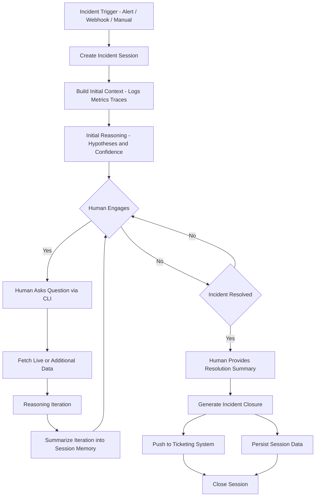

# Judicor – Initial Design & Concept Document

## AI-Driven Incident Reasoning Engine (CLI-First)

---

## 1. Background & Motivation

Modern operational systems (Cloud, Distributed Systems, Production Infra) generate massive amounts of data:

- Logs
- Metrics
- Traces
- Alerts
- Anomalies

Despite major advances in observability, during an incident the core problem is **not lack of data, but excess data without judgment or context**.

Operators are required to:

- Filter noise (alert fatigue)
- Understand relationships between signals
- Decide what is primary vs secondary
- Act under pressure and uncertainty

Operational knowledge from previous incidents usually:

- Lives in people’s heads
- Or is buried in postmortems
- And is unavailable during live incidents

---

## 2. The Problem

There is currently no operational layer focused on **judgment**.

Existing tools:

- Measure
- Alert
- Visualize

But they do not:

- Explain meaning
- Express uncertainty
- Rank trustworthiness
- Support human investigation in real time

Most “AIOps” solutions focus on:

- Correlation
- Clustering
- Automation

Instead of **responsible decision support for humans**.

---

## 3. The Solution – Judicor

**Judicor** is an AI-driven reasoning engine that acts as a judgment layer on top of existing observability systems.

Judicor:

- Does **not** replace Prometheus / logging / tracing
- Does **not** act autonomously
- Is **not** UI-first

Instead:

> Judicor accompanies an incident as a reasoning session, helping humans understand, decide, document, and close incidents responsibly.
>

---

## 4. Core Design Principles

1. **Human-in-the-Loop** – humans always decide
2. **Session-Based** – every incident has a lifecycle
3. **Event-Driven** – reasoning runs only when needed
4. **CLI-First** – terminal is the primary interface
5. **Efficiency by Design** – predictable LLM usage
6. **Explicit Uncertainty** – “I don’t know” is valid output

---

## 5. High-Level Architecture

### 5.1 Separation of Concerns

Judicor is composed of three layers:

### 1️⃣ Core Engine (Stable)

- Session lifecycle management
- Session State Model
- Reasoning loop
- Confidence & uncertainty handling
- Closure & summarization
- Prompt governance

#### No dependency on external systems

---

### 2️⃣ Integration Layer (Pluggable)

- Observability data sources
- Ticketing systems
- Storage backends

Implemented via plugins / MCP adapters

Replaceable without touching the core engine

---

### 3️⃣ Interface Layer

- CLI (primary)
- Slack / Telegram (thin adapters)
- Web UI (optional future adapter)

---

## 6. Runtime Model – Where It Runs

Judicor is **not** an always-running AI agent.

### Control Plane (Always On)

- Lightweight service
- Receives triggers
- Manages sessions
- Exposes API for CLI / adapters

### Reasoning Engine (On Demand)

- Ephemeral process
- Triggered by:
  - Incident start
  - Human question
  - Material state change
- Calls Gemini
- Updates session state
- Terminates

> Judicor thinks only when needed.
>

---

## 7. Incident Session Flow

### 7.1 Trigger → Session Creation

- Webhook / alert / manual trigger
- Incident session is created
- Session remains open until human closure

---

### 7.2 Initial Reasoning (Proactive)

Judicor:

- Fetches data around trigger origin
- Classifies signals (primary / secondary / FP / FN)
- Produces an initial assessment including:
  - Hypotheses
  - Missing information
  - Confidence level

---

### 7.3 Interactive Reasoning Loop

Human:

- Interacts via CLI

Judicor:

- Maintains structured session state
- Fetches live data when required
- Summarizes each iteration into session memory
- Returns context-aware reasoning

The LLM is **not memory**.

The session state is.

---

### 7.4 Resolution & Closure

Human:

- Marks incident as resolved
- Provides resolution summary

Judicor:

- Normalizes the summary
- Generates ticket-ready incident closure
- Pushes to ticketing system
- Stores full session in ElasticDB
- Closes the session

---

## 7.5 Flow Diagram



---

## 8. Gemini Usage (Core Dependency)

Judicor depends on **Gemini API** as its reasoning engine.

Gemini is used for:

- Signal classification
- Hypothesis generation
- Contextual synthesis
- Explanation generation
- Uncertainty identification

Gemini **never owns authority**.

Judicor controls:

- Language
- Confidence thresholds
- Output gating

---

## 9. Uncertainty & Hallucination Control

Judicor enforces external trust controls:

- Gemini outputs:
  - Hypotheses
  - Supporting signals
  - Missing signals
  - Assumptions
- Judicor computes:
  - Confidence level (LOW / MEDIUM / HIGH)
  - Whether conclusions may be presented
  - Whether actions may be suggested

“Insufficient Evidence” is a **first-class state**.

> Confidence is a system property, not a model property.
>

---

## 10. CLI-First Interface

Judicor is operated primarily through a CLI:

```bash
judicor trigger ...
judicor status
judicor ask "Why is alert X secondary?"
judicor resolve

```

CLI:

- Is the operational truth
- Provides auditability
- Anchors all future interfaces

Chat integrations are adapters, not primary surfaces.

---

## 11. Efficiency & Cost Awareness

Judicor is token-efficient by design:

- Context is built once per incident
- Each iteration uses a distilled session snapshot
- No conversation dumping
- No long-running agents

> Efficiency is a design constraint, not an optimization.
>

---

## 12. Future Direction (Out of Hackathon Scope)

- Human-approved command execution
- Scoped write access via operator shell
- Action suggestion plugins
- Web UI as adapter only

Invariant rule:

> No autonomous writes. No privilege escalation.
>

---

## 13. Summary

Judicor is:

- An engine, not an app
- A judgment layer, not an observability tool
- CLI-first, not AI-UI-first
- Event-driven, not agent-driven

It exists to answer one question:

> “What does what’s happening right now actually mean, and what should — or should not — be done?”
>